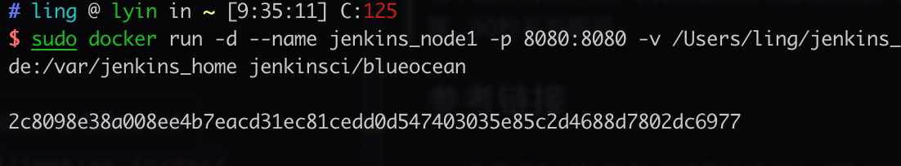
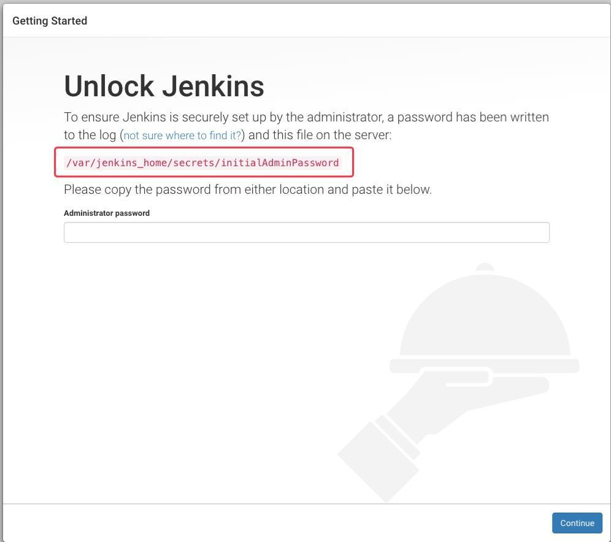
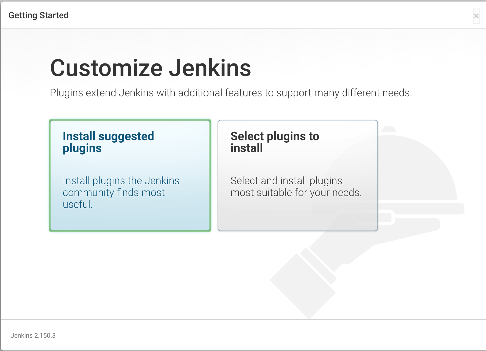

# docker jenkins node 部署记录

## 环境
- MacOS
- 已安装docker 18.06.1-ce-mac73 (26764)

## 部署记录

### 1. docker安装jenkins
```
sudo docker run \
    --rm \
    -d \
    -u 0 \
    --privileged \
    --name jenkins_node \
    -p 8080:8080 \
    -v /var/run/docker.sock:/var/run/docker.sock \
    -v /Users/ling/jenkins_node:/var/jenkins_home \
    -v /Users/ling/nginx/html:/usr/share/nginx/html \
    jenkinsci/blueocean
```

我的网站目录
`/usr/share/nginx/html/3L-Blog/dist`


`	sudo docker run -d -u 0 --privileged  --name jenkins_node1 -p 49003:8080 -v /root/jenkins_node1:/var/jenkins_home jenkins:latest`

`ln -s /usr/local/bin/node /usr/bin/`

`sudo docker container run --rm -p 3000:3000 -v /Users/ling/react-hoos-todo:/home/react-hooks-todo -it react-hooks-todo`


> - 进入容器命令：`docker exec -it [hash]或[container name]`
>  - 关闭容器命令 `docker stop jenkins_node1`


成功截图：


1. 这句命令的意思是：在后台运行一个基于jenkinsci/blueocean镜像的容器, 容器的名字叫做 jenkins_node ,把容器的8080端口映射为8080端口，并且把服务器上的/Users/ling/jenkins_node目录挂在到docker容器上的/var/jenkins_home目录.

    注意 `/Users/ling/jenkins_node`是我Mac的home目录下的jenkins_node文件夹，ling是我的用户名。此处修改为自己的目录。

2. -d 后台运行docker容器

    用此终端，如果终端关闭，则容器也相应关闭，jenkins就无法访问了。加上-d,容器会在后台运行。

3. --name 为容器起个别名

    如果不起别名，则系统会默认分配一个随机别名，类似gklasd_sdfwe。起了别名后，后续会通过该别名管理该docker容器，也就是管理jenkins。

4. -p docker容器端口映射

    jenkins服务是运行在docker里的，docker默认不对外暴露端口的

5. -v 文件挂载

    如果不挂载，则jenkins所有log、用户配置文件都会在docker容器内，如果容器销毁，则jenkins得重新配置一遍。挂载出来方便jenkins迁移以及管理

查看你宿主机上的的/Users/ling/jenkins_node文件夹,当出现下图所有文件时，则说明jenkins启动成功，否则再等等...30秒左右即可


### 2. 登录jenkins

1. 按照提示找到初始密码登录


2. 安装插件（我是安装推荐插件，熟练可以自己配置）


3. 

### 3. 部署node项目


## docker jenkins容器老师自动关闭？
解决方案：
1. 长时间执行命令前后包裹 `set -x` shell `set +x`.
2. jenkins网页。节点配置BUILD_ID
3. 在脚本前面添加上BUILD_ID=XXXXX，即可如下：

以上都没有用的，终于找到原因了。是因为阿里云服务器太差，一核心2G内存完全不够用。所以出发了`OOM kill`机制，把进程改关掉了。`grep -i -r 'killed process' /var/log`查看日志可以看到。
```
/var/log/messages:Mar 16 15:05:12 izbp15rn6xcyri1kk9frkdz kernel: Killed process 4900 (node) total-vm:996216kB, anon-rss:374624kB, file-rss:0kB, shmem-rss:0kB
/var/log/messages:Mar 16 15:07:23 izbp15rn6xcyri1kk9frkdz kernel: Killed process 5585 (docker) total-vm:166296kB, anon-rss:24272kB, file-rss:0kB, shmem-rss:0kB
/var/log/messages:Mar 16 15:07:33 izbp15rn6xcyri1kk9frkdz kernel: Killed process 2569 (java) total-vm:2111548kB, anon-rss:386508kB, file-rss:0kB, shmem-rss:0kB
```
有很多重复此样的日志，说明进程是被kill掉了。

**解决方法：** 添加Swap交换空间。[在CentOS 7上添加Swap交换空间](https://blog.csdn.net/zstack_org/article/details/53258588)


## 参考链接
1. [Build a Node.js and React app with npm ](https://jenkins.io/doc/tutorials/build-a-node-js-and-react-app-with-npm/)
2. [一步一步打造jenkins+docker+nodejs项目的自动部署环境
介绍](https://blog.csdn.net/chengly0129/article/details/70292953)
3. [实战笔记：Jenkins打造强大的前端自动化工作流](https://juejin.im/post/5ad1980e6fb9a028c42ea1be)
4. [在CentOS 7上添加Swap交换空间](https://blog.csdn.net/zstack_org/article/details/53258588)


