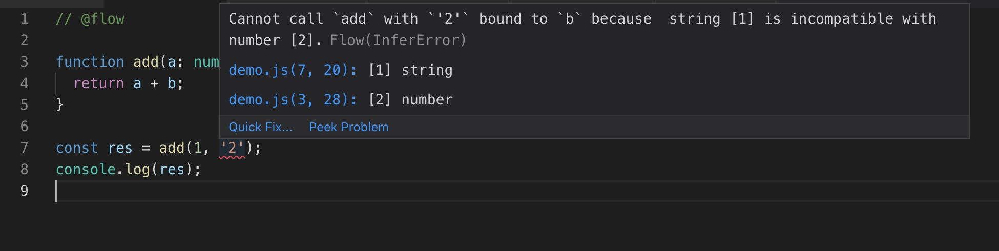

## 前置工作
工欲善其事，必先利其器。我们先来配置一个良好的环境吧，这可以给以后编码节省大量的时间。

### 安装

首先需要安装`@babel/core @babel/cli @babel/preset-env`和` @babel/preset-flow`
> 此处跟官网不同，官网使用的还是babel6，我用的是babel7.
```shell
yarn add --dev @babel/core @babel/cli @babel/preset-env @babel/preset-flow
```
然后在根目录创建.babelrc文件
```json
{
  "presets": ["@babel/preset-flow"]
}
```
如果你需要将flow文件编译成普通js，使用以下命令
```shell
yarn run babel src/ -- -d lib/
```
为了方便，我们可以把它配知道`package.json`中
```json
{
  "name": "my-project",
  "main": "lib/index.js",
  "scripts": {
    "build": "babel src/ -d lib/",
    "prepublish": "yarn run build"
  }
}
```

### fix vscode 报错
```flowjs
// @flow

function add(a: number, b: number): number {
  return a + b;
}
```
在vscode中插入这样一段代码，控制台会报错`'types' can only be used in a .ts file.`。这是因为vscode会使用ts检测语法，但是文件后缀名不是ts导致的。
**解决方法：**
1. 在vscode设置中关闭校验。`"javascript.validate.enable": false`
2. eslint报错。
```
// 1. 先安装eslint-plugin-flowtype
// 2. 安装以来babel-eslint
// 3. 修改eslintrc
{
  "parser": "babel-eslint",
  "plugins": [
    "flowtype"
  ]
}
```

> 在vscode中 安装这个拓展 ： [Flow Language Support](https://marketplace.visualstudio.com/items?itemName=flowtype.flow-for-vscode) 可以实时校验语法.须先`npm install flow-bin -g`，并全局flow-bin版本和项目内flow-bin版本保持一致。




### Setup Flow
Add a devDependency on the flow-bin npm package:
```
yarn add --dev flow-bin
```
Run Flow:
```
yarn run flow
```
>  you may need to run yarn run flow init before executing yarn run flow.

### 在后台运行flow
为了实时看到语法提示，我们可以在后台运行flow，通过vscode的Flow Language Support实时校验。
```
flow status
```
> 如果需要关闭后台进程，运行 `flow stop`

**恭喜，至此，flow的配置就算大功告成了，享受flow带来的愉悦吧！**

## 正式进入Flow学习
### 类型声明
> 类型声明是flow一个很重要的部分。

在javascript中，有6种基本类型。
- Booleans
- Strings
- Numbers
- null
- undefined (void in Flow types)
- Symbols (new in ECMAScript 2015, not yet supported in Flow)
除了Symbols类型在Flow中不支持，其余均支持。
```js
// @flow
//void 代表undefined类型
function method(x: number, y: string, z: boolean, a: void, b: null) {
  return { x, y, z, a, b };
}

method(3.14, 'hello', false, undefined, null );
```
#### 给object声明属性
`?:`代表该值可选
```
function setPerson(person: { name: string, age: number, email?: string }) {
  return {
    ...person
  };
}

setPerson({name:'an',age:20})
```

#### Tuple Types
翻译过来说是元组类型，但是我觉得很好理解，就是给数组的每一项指定类型。
```
// @flow
let tuple: [number, boolean, string] = [1, true, "three"];

let num  : number  = tuple[0]; // Works!
let bool : boolean = tuple[1]; // Works!
let str  : string  = tuple[2]; // Works!
```

#### Array Type
翻译过来说是数组类型，他不用于Tuple Types的是，前者指定的是每一项的类型，它指定的是整个数组所有元素的类型。
语法：`Array<Type>`.
```
let arr1: Array<boolean> = [true, false, true];
let arr2: Array<string> = ["A", "B", "C"];
let arr3: Array<mixed> = [1, true, "three"]
```
还有一种写法是：`Type[]`
```
let arr: number[] = [0, 1, 2, 3];
```
**备注：Array<?T> 或 (?Type)[]**我理解的是：表示数组可能是T类型，可以不是T类型，但是必定要是一个数组。

```
// @flow
let arr1: (?number)[] = null;   // Error!
let arr2: (?number)[] = [1, 2]; // Works!
let arr3: (?number)[] = [null]; // Works!
```

#### Interface Types


